# Week 0 — Billing and Architecture

<h3>Discussing the format of the boot camp?</h3>

- This is a 14-week Boot camp from February 11 until the end week of May 2023.
- Boot camp will be focused on using the AWS cloud technologies.
- Each week's sessions build off each other and are connected from the first to the last sessions.
- Organizer will provide homework for a knowledge transfer using discord, youtube live for a communication channel.
- There are also grading and completion you will earn a digital badge from the boot camp organizer.
- One requirement you need to Bring your Account or your free tier AWS account, the Domain name that you can access DNS record settings also be able to apply at least two subdomains from the domain name that has been purchased.
- Done every Saturday at (noon) Toronto Time (UTC-5)
- Sessions will be recorded and the organizer will post the link for the youtube playlist.

<h3>Going over the business use-case of our project?</h3>

- You have been hired as a new Employee on a startup. as a cloud engineer interviewed by a co-founder, you will handle the app project using a microservice that can leverage the decoupling of components so that the app will survive in case of a disaster strike. you ask what are microservices and their benefit from your projects and the Co-Founder tells you about Agility, Easy Deployment, Technological Freedom from other providers, and also flexible scaling.
- in the sessions organizer also quote the “Iron Triangle” that will give you the quality with proportion to Cost, Time, and Scope. that will affect the project along the way. as a project stakeholder and member.

`Note the following during the kickoff meeting with the team.`

- The app is an ephemeral-first micro-blogging platform
- fractional CTO so less collaboration -partly developed an app - always keep updating
- how to monetize the platform  
- front end = JS using React 
- Back end 
- python using flask 
- api based only 
- budget constraint -user content upload?
- target user college students younger students and professionals 
- need user validation 
- need to implement age limit? 
- AWS cloud technologies
- What services need to run? for microservices it’s Containers?
- Set up budget Monitoring
- User Engagement for their user stories on their features request
- Technical report due needed ASAP by investors
- Architecture Diagram
- Budget Allocation
- Operational Expenses or OPEX
    

<h3>Looking at an architectural diagram of what we plan to build</h3>

- first considered AWS's well-architected framework
- Operational Excellence
- Security Pillar
- Reliability Pillar
- Performance Efficiency
- Cost Optimization
- Sustainability

<h3>Using Lucid charts architecture diagram</h3>

- <a href="https://lucid.app/lucidchart/a40c1e85-8fc6-4531-a9a2-1c9df62b4348/edit?viewport_loc=32%2C508%2C1584%2C579%2C0_0&invitationId=inv_eac5ee7a-7a3f-49ab-a38f-86ca28c05df1">Conceptual Diagram</a>

- <a href="https://lucid.app/lucidchart/98ecfcd9-dde0-4ec1-bb26-8ec08c851745/edit?viewport_loc=-151%2C0%2C2042%2C800%2C0_0&invitationId=inv_6eca123c-ba15-41e0-96d5-bbb6f7b37e26">Logical Diagram</a>

<h3> Use of C4 models</h3>

- use as an architect tool for creating a viable product 
- Has 4 categories, System Context, Containers, Component, and Code;
- System Context - starting points and talks about how the system will fit in the environment
- Containers - These were the building blocks of functions of every component 
- Component -  This is the granular components of every container 
- Code - This is how components will be implemented 

<h3>Running the cloud services we will utilize</h3>

- AWS Services and their free tier components and make sure we got less cost when doing this projects

<h3>Testing that we can access our AWS accounts</h3>

- Go to this link [https://signin.aws.amazon.com/](https://signin.aws.amazon.com/ "sign in")
- Login to your account, fill up the username and password
- root account is powerful that’s why is prohibited to use if not necessary
- best practice is to create a group and grant administrative IAM policy in that group.
- and then create a normal or another user and include them in the administrative group.

<h3>Track spend in AWS eg. AWS Budgets, AWS Cost Explorer, Billing Alarms.

Understanding how to look at monthly billing reports.</h3>

<h4>AWS budgets</h4> 
    
- go to your AWS console
- on the search bar type AWS budget
  
- look for the AWS budget and click to go to the dashboard
  
- in this dashboard, you can find the budget or you can click a wizard. like this name My Zero-Spend Budget
- click and follow the wizard.

<h4>AWS Billing Alarms</h4>

- or create your own budget setup if you click customized (advanced). 
  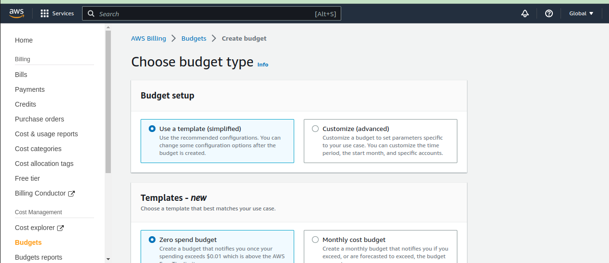
- in the budget types you can pick cost budget 
  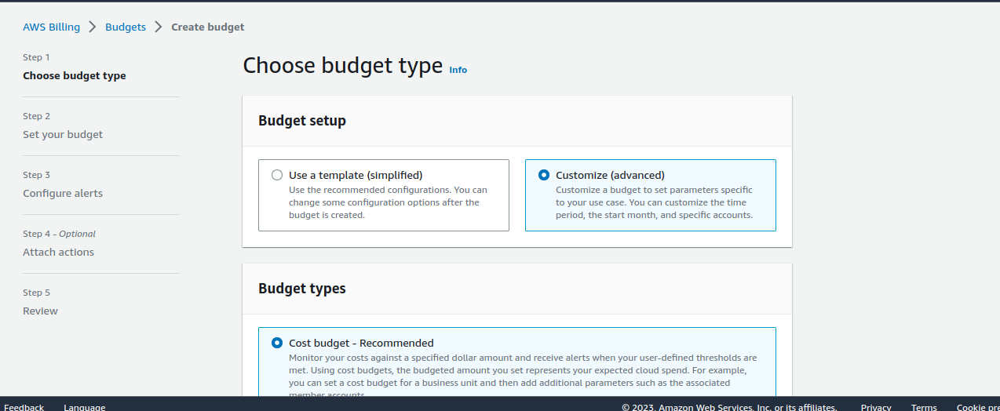
- when you click next you can right the tag name for the billing alerts 
  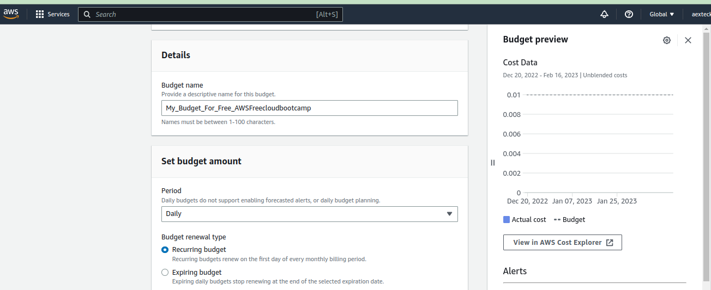
- now you can put the allocated amount for this budget like in my setup it will cost 0.01$
  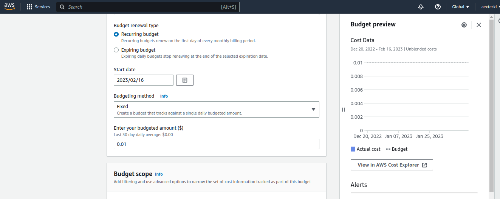
- you can go to scope options and you can choose blended. I like to have a unblended cost for this i will know who will trigger my cost in AWS 
  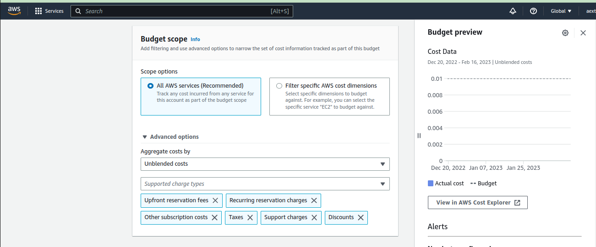
- Now you can create your own billing alerts for threshold
  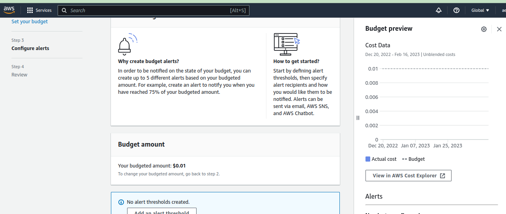
- the alerts threshold that will trigger by the percent you input in the threshold trigger box and you can put also your email address for the notification
  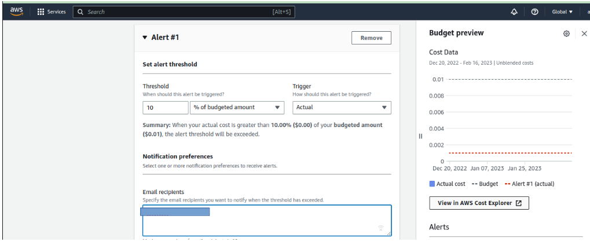
- now you can review the configuration you made 
  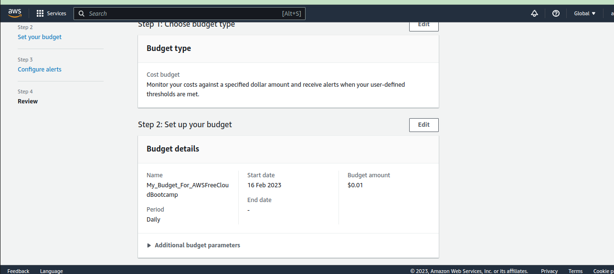
- if everything is good. click create 
  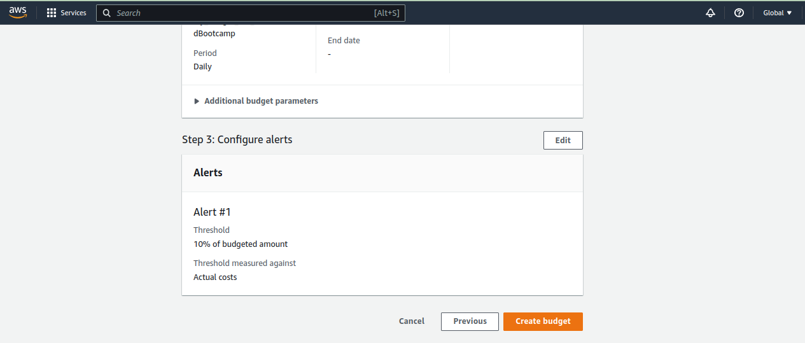
- it will go and activate and goes to overview page or billing dashboard.
  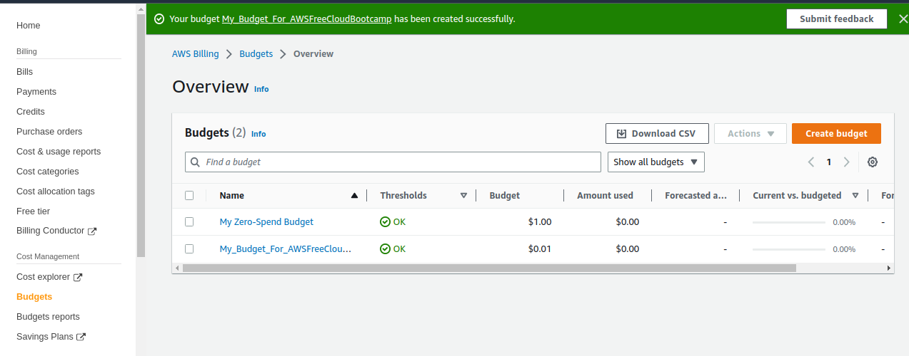

<h4> AWS Cost Management & AWS Cost Explorer</h4>

- in home of cost management you will see in the dashboard tbe cost report
  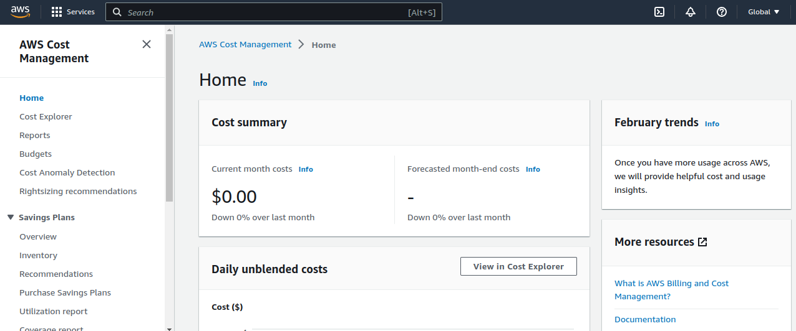
- at cost management dashboard you will see the cost explorer
  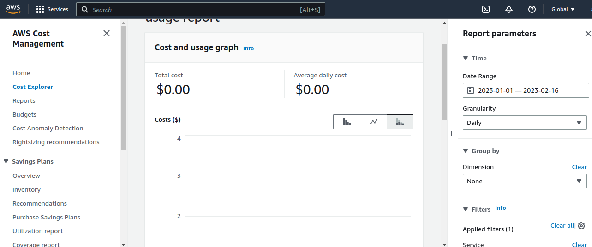
- in the dashboard you can also see the cost report 
  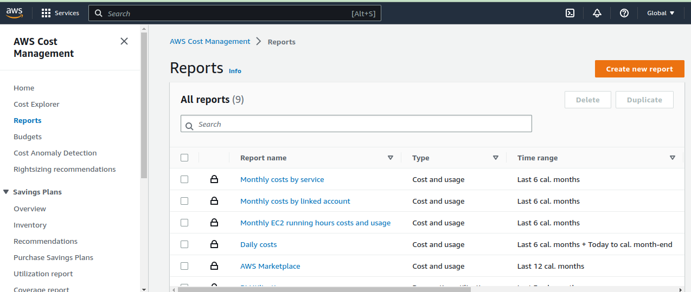
- you can also create a new report 
  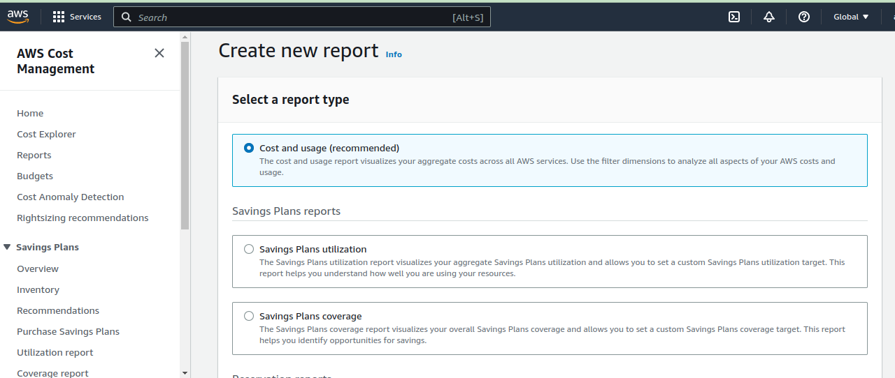
- the usage and report will seen in the dashboard
  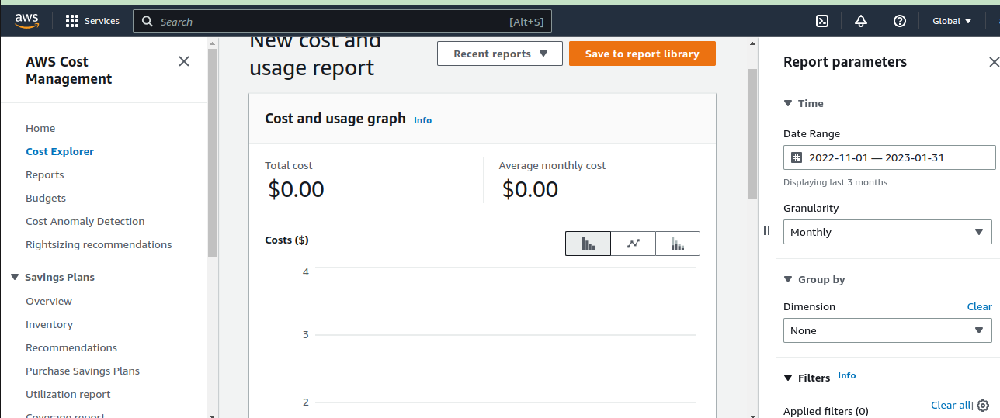

<h3>Launching AWS CloudShell and looking at AWS CLI</h3>

- on the top of your AWS console you will see the first icon on the right pane.
  

- once click in you will be greeted by the AWS CLI banner 
  

- and Then you can start the terminal
  
  
  
 <h3>Installing AWSCLI in gitpod.io environment </h3>
 
 - in the gitpod enviroment loaded, you will see a terminal on the down part of the screen. 
 - the terminal window is a bash terminal.
 - type this curl "https://awscli.amazonaws.com/awscli-exe-linux-x86_64.zip" -o "awscliv2.zip"
   unzip awscliv2.zip
   sudo ./aws/install
 - the first command curl is to get it from the internet and download it to your gitpod enviroment.
 - the second command will unzip it.
 - the third command will install the awscli environment.
 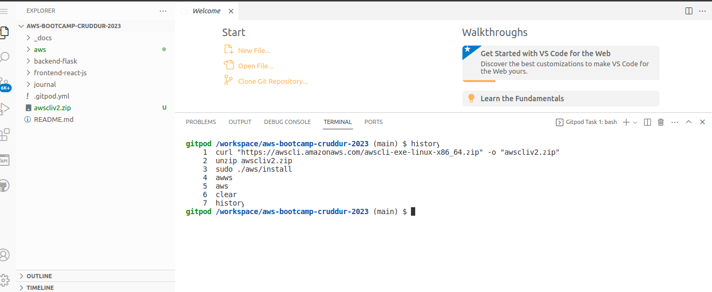
 - also I already installed it on my local Linux Ubuntu Machine. 
 
 
 
<h3> Installing momento inside gitpod terminal </h3>
<h3> Homework Challenges </h3>
- I used wget to download the binary for linux .deb files 
- <a href="https://github.com/momentohq/momento-cli/releases"> memonthq github page </a>
- 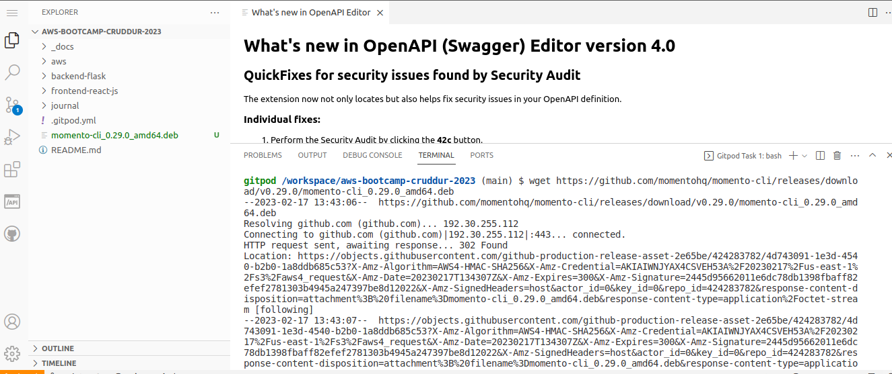
- then use dpkg for hadling deb files installation 
- 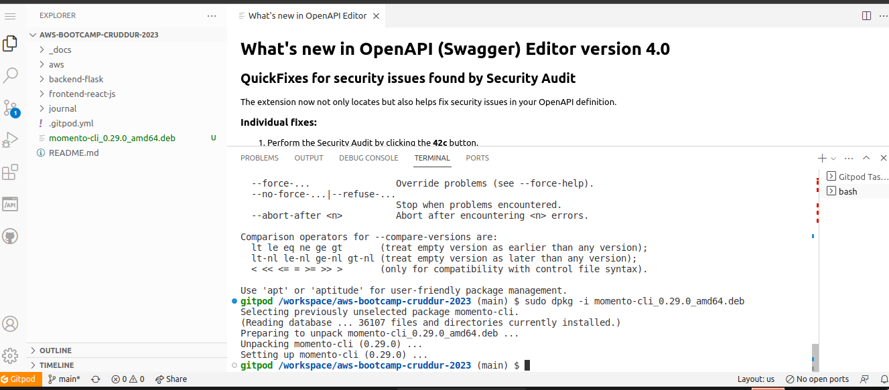
- to verified it's been installed you can type memonto in cli 
- 

<h3>Generating AWS credentials</h3>

- consider the root account user already login in AWS console.
- click on the search box and look for IAM (Identity access management).
- IAM is a global service you will see the dashboard 
- then create the user. you can choose the type of login:
    - programmatic 
    - AWS console sign in
- you can create your password or auto-generated by AWS IAM
- please be aware for the https://(accountnumber).signin.aws.amazon.com/console that IAM give for every user.
