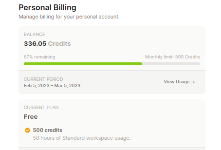
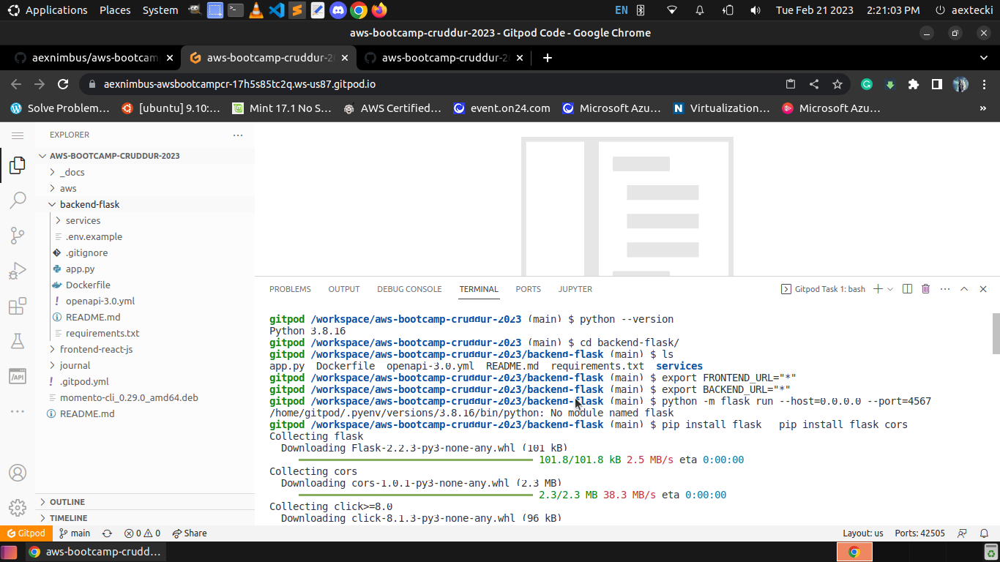
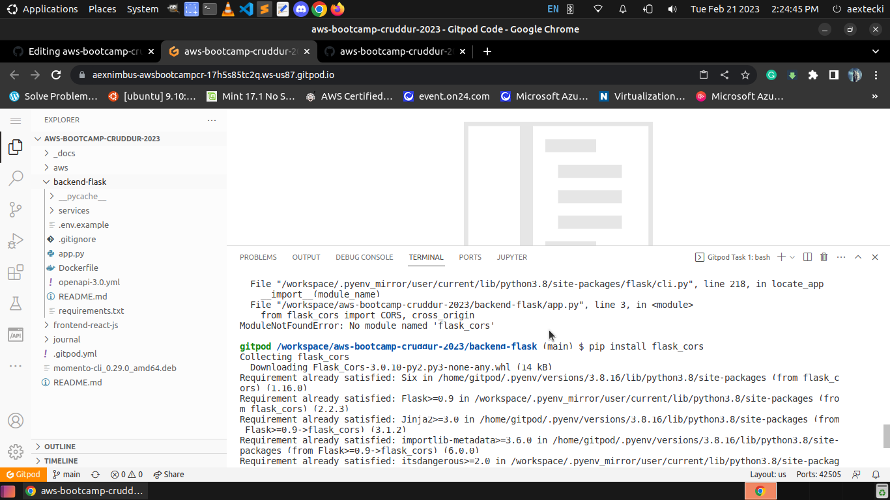
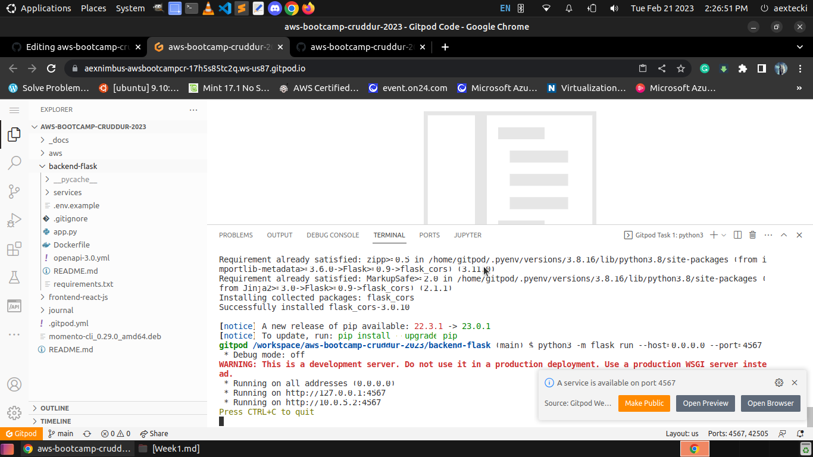
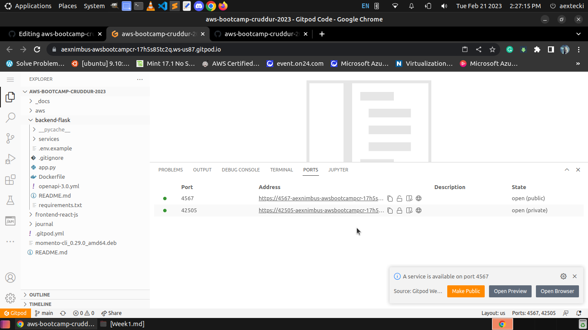
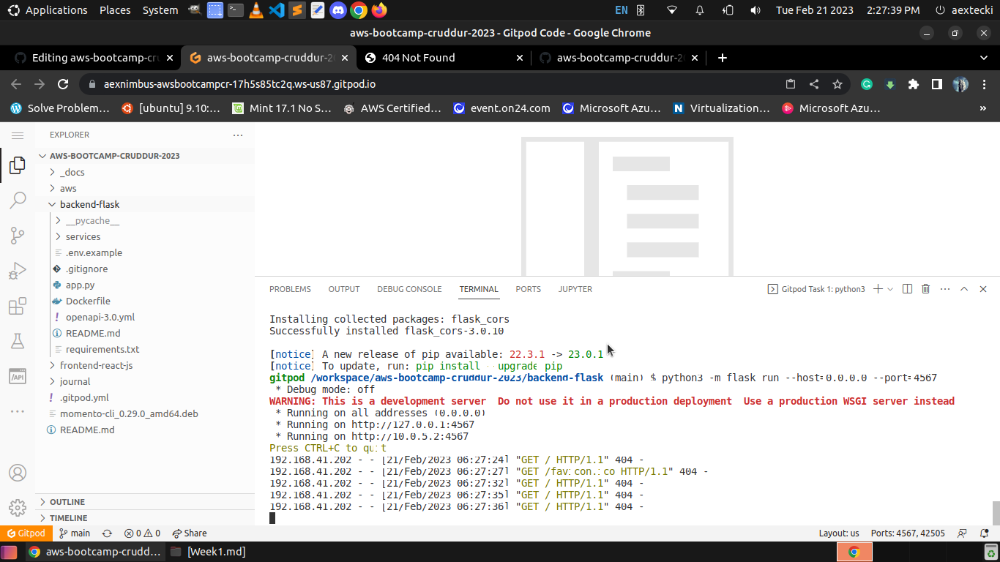

# Week 1 — App Containerization

<h2>Why Containerized your APP?</h2>

<p><i>Developers refer to containers as “lightweight” because they share the host machine's OS kernel and aren't subject to extra overhead. Their lightweight feature drives higher server efficiencies and reduces server and licensing costs. It also speeds up start-time since there is no OS to boot.</i><p>

credit to this site :<a href ="https://www.veritas.com/information-center/containerization#:~:text=Developers%20refer%20to%20containers%20as,is%20no%20OS%20to%20boot.">www.veritas.com</a>
  
  <h2> Let's Talk about microservices mindset </h2> 
  credit to this guy:<a href ="https://medium.com/@deepeshthakkar14/microservices-as-a-mindset-not-micro-monoliths-7d72d98b0b26">Deepesh Thakkar</a>
  <h3>Microservices as a mindset — Not “micro-monoliths”</h3>
<p>The new trend in the cloud computing world breaking up monoliths into microservices to improve the scalability of systems. But is that the only reason why we do it? Along with scalability, there are a ton of other benefits that come with microservices. These benefits are not just good to have but are highly demanded by modern-day customers. Enterprise customers demand high availability, low latency, quick delivery of features, etc. But these benefits can only be reaped if certain practices are followed. In order to follow these practices, you not only need to change your code but your mindset about how to perceive these services. Understanding the motivation and the intent of creating microservices is critical to driving the success of any modern cloud application.</p>

<h3> As per the CTO expectation we need to containerized the application</h3>
<ul>
  <li> React JS = Frontend</li>
  <li> Python Flask = Backend</li>
</ul>

-Starting our gitpod as CDE(code development environment) that will give us more flexibility in implementing the code. just for the consideration we need to consider our freetier credit so use it wisely. 



- Change Directory to our backend-folder with the path of /workspace/aws-bootcamp-cruddur-2023/backend-folder



```
cd /backend-folder
```
- Export shell enviroment variables 

```
export FRONTEND_URL="*"
export BACKEND_URL="*"

```
- And run this command "python3 -m flask run --host=0.0.0.0 --port=4567"

```
python3 -m flask run --host=0.0.0.0 --port=4567

```
- note: the shell will notify you if the flask is needed. you need to install it via terminal, in my case it's looking for flask module and cors 

```
pip install flask 
pip install flask_cors

```
- If everything has installed and setup 



- Type again the python flask run command 



- untick the lock in the port tab besides terminal it's need to publicly available in the internet.



- Flask server log for errors. this is a sign everything good working at the backend




