# Week 1 — App Containerization

<h2>Why Containerized your APP?</h2>

<p><i>Developers refer to containers as “lightweight” because they share the host machine's OS kernel and aren't subject to extra overhead. Their lightweight feature drives higher server efficiencies and reduces server and licensing costs. It also speeds up start-time since there is no OS to boot.</i><p>

credit to this site :<a href ="https://www.veritas.com/information-center/containerization#:~:text=Developers%20refer%20to%20containers%20as,is%20no%20OS%20to%20boot.">www.veritas.com</a>
  
  <h2> Let's Talk about microservices mindset </h2> 
  credit to this guy:<a href ="https://medium.com/@deepeshthakkar14/microservices-as-a-mindset-not-micro-monoliths-7d72d98b0b26">Deepesh Thakkar</a>
  <h3>Microservices as a mindset — Not “micro-monoliths”</h3>
<p>The new trend in the cloud computing world breaking up monoliths into microservices to improve the scalability of systems. But is that the only reason why we do it? Along with scalability, there are a ton of other benefits that come with microservices. These benefits are not just good to have but are highly demanded by modern-day customers. Enterprise customers demand high availability, low latency, quick delivery of features, etc. But these benefits can only be reaped if certain practices are followed. In order to follow these practices, you not only need to change your code but your mindset about how to perceive these services. Understanding the motivation and the intent of creating microservices is critical to driving the success of any modern cloud application.</p>

<h3> As per the CTO expectation we need to containerized the application</h3>
<ul>
  <li> React JS = Frontend</li>
  <li> Python Flask = Backend</li>
</ul>

-Starting our gitpod as CDE(code development environment) that will give us more flexibility in implementing the code. just for the consideration we need to consider our freetier credit so use it wisely. 


<h2> Containerize Back-end</h2>

- Change Directory to our backend-folder with the path of /workspace/aws-bootcamp-cruddur-2023/backend-folder


```
cd /backend-folder
```
- Export shell enviroment variables 

```
export FRONTEND_URL="*"
export BACKEND_URL="*"

```
- And run this command "python3 -m flask run --host=0.0.0.0 --port=4567"

```
python3 -m flask run --host=0.0.0.0 --port=4567

```
- note: the shell will notify you if the flask is needed. you need to install it via terminal, in my case it's looking for flask module and cors 

```
pip install flask 
pip install flask_cors

```
- If everything has installed and setup 


- Type again the python flask run command 


- untick the lock in the port tab besides terminal it's need to publicly available in the internet.


- Flask server log for errors. this is a sign everything good working at the backend


- you must paste this url at the end of gitpod workspace url 

```
/api/activities/home

```

- I seen this internal error 500 


- I also try this in my local ubuntu machine to debug first if the code have error, and json api was appeared in my web browser which is the one we need to see in the gitpod workspace url


- I concluded that the backend code is working and no errors. so I go thru the next instructions to see if i generate this kind of error again.

- Adding Dockerfile inside the backend-flask. we can now containerized this backend application on the fly.

- put his code for the Dockerfile 

```
FROM python:3.10-slim-buster

WORKDIR /backend-flask

COPY requirements.txt requirements.txt
RUN pip3 install -r requirements.txt

COPY . .

ENV FLASK_ENV=development

EXPOSE ${PORT}
CMD [ "python3", "-m" , "flask", "run", "--host=0.0.0.0", "--port=4567"]

```

- then change directory go to upper level folder cd .. and run the code below

```
docker build -t  backend-flask ./backend-flask

```
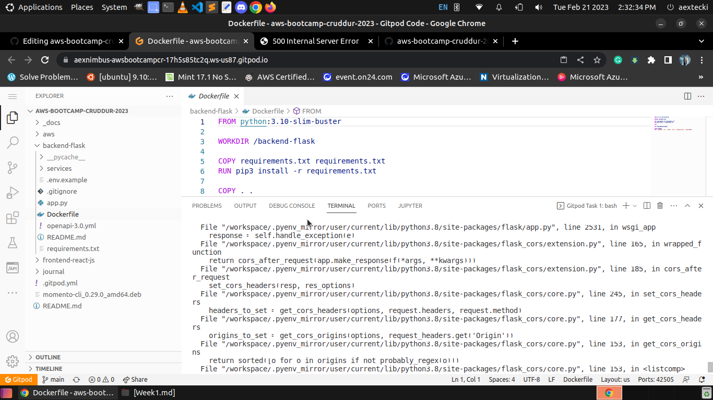

- the docker will pack the backend-flask folder in container


- run the code below 

```
docker run --rm -p 4567:4567 -it backend-flask
```


- then go to port tab and release the lock to view it on your browser 


- and type /api/activities/home again in my case I seen this type error again which is I'm debugging now 


- I'm debugging the code to make it work as expected and test verify at the backend if i generate an error
- I try to change some area of the code that causing an issue for internal 500 and Type Error.
- and then found out the traceback or debug mode of flask is reporting for cors issue. I seen some of app route have cors origin() 

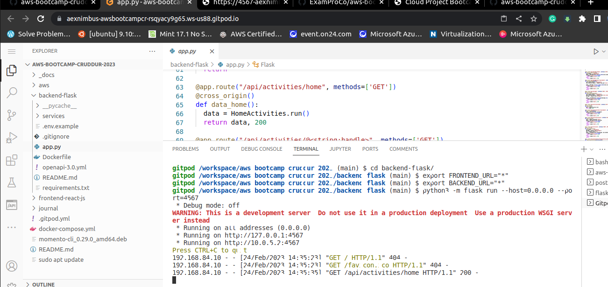

- and it's work out of the box. as a proof testing my backend server is now throwing JSON API value.

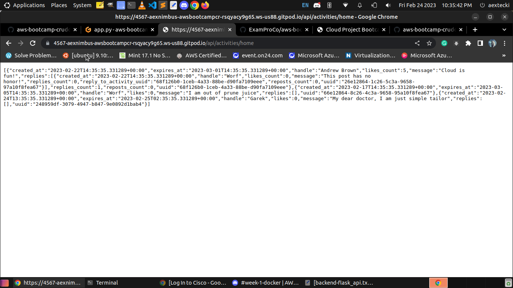


- moving forward in the next instructions and test if I can generate a JSON value when running Containerized application of flask.
- run docker build outside from backend-folder 
 
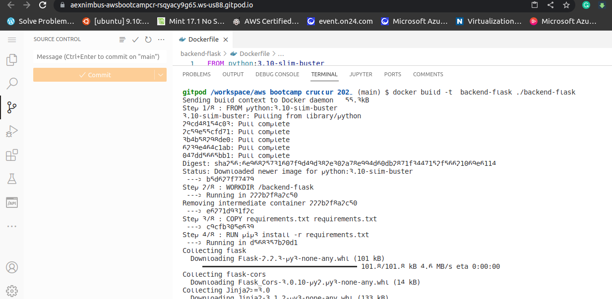

- test the backend again for getting the JSON value API


- Json/API test results 


<h2>Containerize Front-end React</h2>

- install first the requirement of Front End like;

```
cd frontend-react-js
npm i

```


- After installed all the require library and application you can create Dockerfile inside the front-end folder

```
FROM node:16.18

ENV PORT=3000

COPY . /frontend-react-js
WORKDIR /frontend-react-js
RUN npm install
EXPOSE ${PORT}
CMD ["npm", "start"]

```
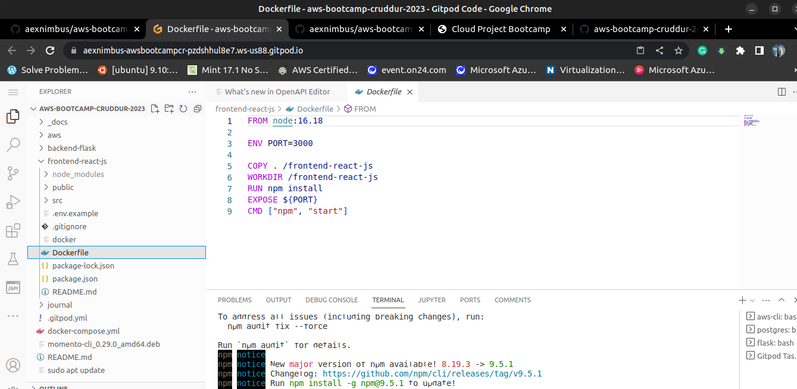

- change dir by typing "cd.." and type this to build a docker and pull the images from dockerhub.

```
docker build -t frontend-react-js ./frontend-react-js

```
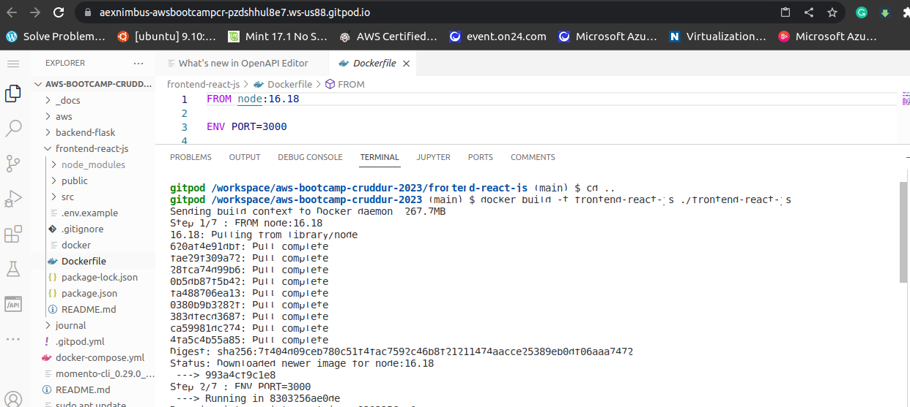

- if all goes successful type in the terminal to run the docker container images 

```
docker run -p 3000:3000 -d frontend-react-js

```
- you will see the crudder app is working at your browser just signup up and the put the passcode as 1234

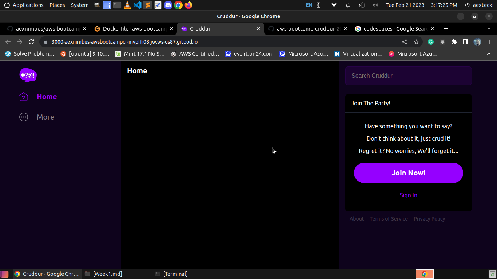

<h3> Create Docker-compose of Back-end & Front-end code </h3>

- create docker-compose.yml file in your root folder

```
version: "3.8"
services:
  backend-flask:
    environment:
      FRONTEND_URL: "https://3000-${GITPOD_WORKSPACE_ID}.${GITPOD_WORKSPACE_CLUSTER_HOST}"
      BACKEND_URL: "https://4567-${GITPOD_WORKSPACE_ID}.${GITPOD_WORKSPACE_CLUSTER_HOST}"
    build: ./backend-flask
    ports:
      - "4567:4567"
    volumes:
      - ./backend-flask:/backend-flask
  frontend-react-js:
    environment:
      REACT_APP_BACKEND_URL: "https://4567-${GITPOD_WORKSPACE_ID}.${GITPOD_WORKSPACE_CLUSTER_HOST}"
    build: ./frontend-react-js
    ports:
      - "3000:3000"
    volumes:
      - ./frontend-react-js:/frontend-react-js

# the name flag is a hack to change the default prepend folder
# name when outputting the image names
networks: 
  internal-network:
    driver: bridge
    name: cruddur
    
```

- cut and paste the code and save it as docker-compose.yml

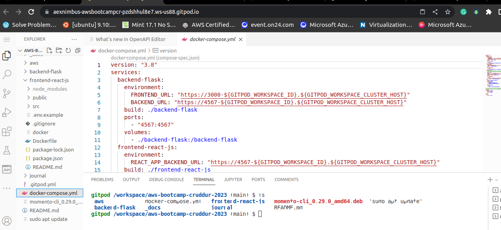

- and hit docker compose up 

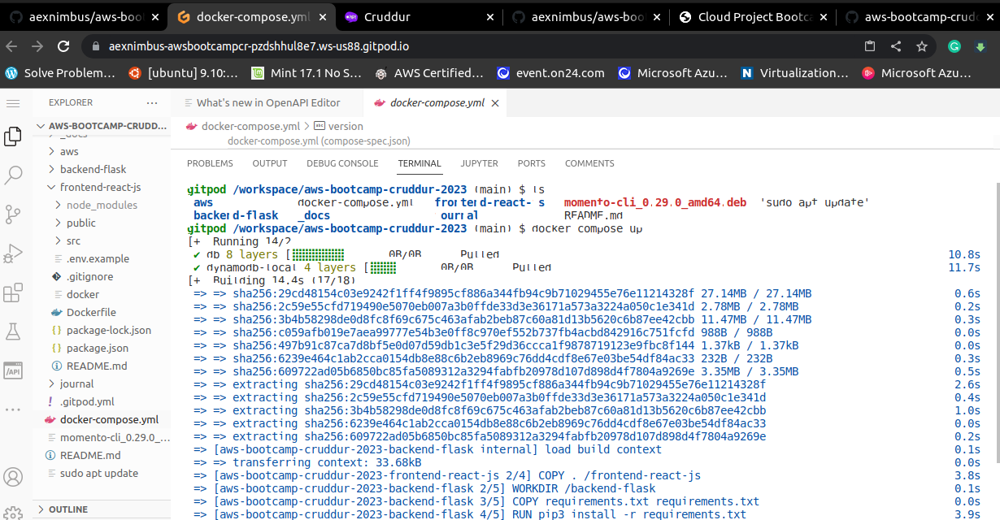

- need to verify this port it appears at port tab 

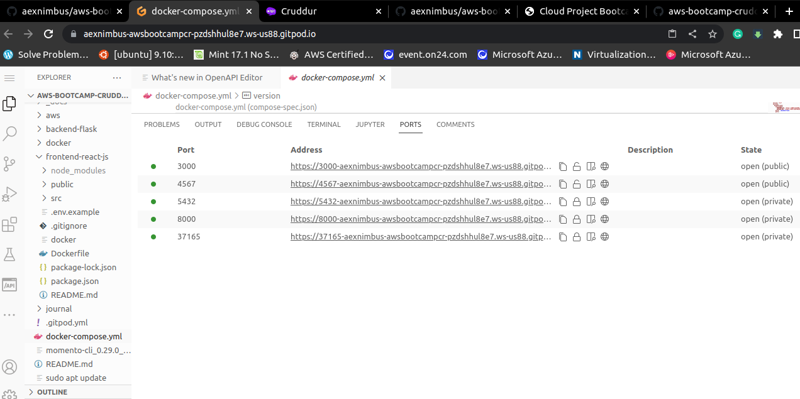

- you can also test using curl 

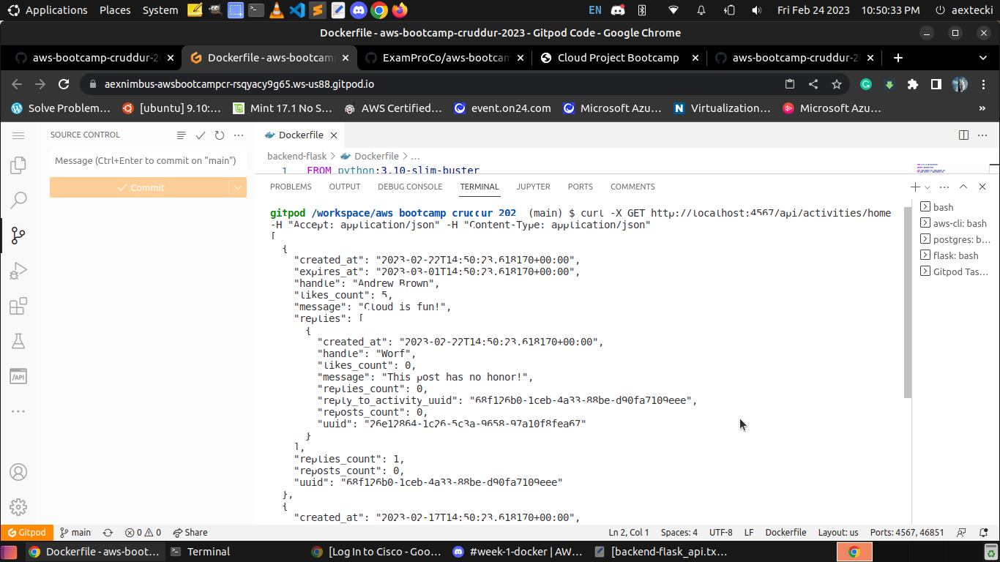

- if everythig is good you will see in the port 3000 the crudder app

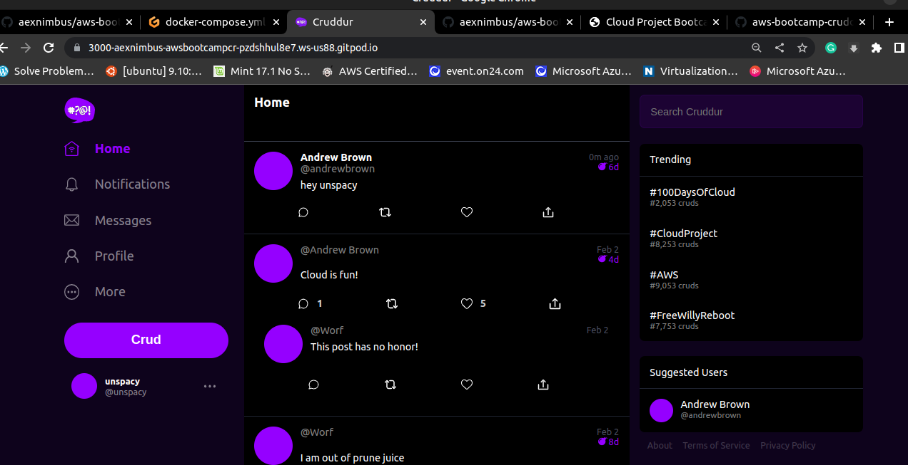
