# Week 2 — Distributed Tracing

Playing with Xray inside the back-end 

```
export AWS_REGION="ca-central-1"
gp env AWS_REGION="ca-central-1"
```

Add to the  inside back end flask `requirements.txt`

```
aws-xray-sdk
```

Add python dependencies using pip install 
```
pip install aws-xray-sdk
```

Then run this at the back end-flask folder

```
pip install -r requirements.txt
```

Add to `app.py`

```
from aws_xray_sdk.core import xray_recorder
from aws_xray_sdk.ext.flask.middleware import XRayMiddleware

xray_url = os.getenv("AWS_XRAY_URL")
xray_recorder.configure(service='Cruddur', dynamic_naming=xray_url)
XRayMiddleware(app, xray_recorder)
```

Setup AWS X-ray resources 

Add `aws/json/xray.json`

```
{
  "SamplingRule": {
      "RuleName": "Cruddur",
      "ResourceARN": "*",
      "Priority": 9000,
      "FixedRate": 0.1,
      "ReservoirSize": 5,
      "ServiceName": "Cruddur",
      "ServiceType": "*",
      "Host": "*",
      "HTTPMethod": "*",
      "URLPath": "*",
      "Version": 1
  }
}
```

```
FLASK_ADDRESS="https://4567-${GITPOD_WORKSPACE_ID}.${GITPOD_WORKSPACE_CLUSTER_HOST}"
aws xray create-group \
   --group-name "Cruddur" \
   --filter-expression "service(\"$FLASK_ADDRESS\") {fault OR error}"
```

Type at the Terminal 

```
aws xray create-sampling-rule --cli-input-json file://aws/json/xray.json
```
and you will get this inside your AWS console 

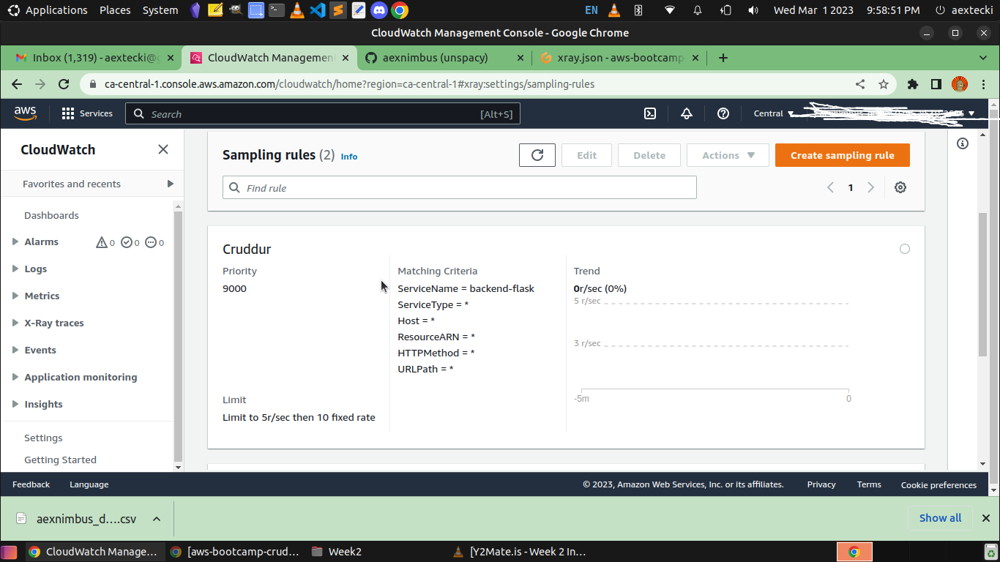

[Install X-ray Daemon](https://docs.aws.amazon.com/xray/latest/devguide/xray-daemon.html)

[Github aws-xray-daemon](https://github.com/aws/aws-xray-daemon) 

[X-Ray Docker Compose example](https://github.com/marjamis/xray/blob/master/docker-compose.yml)

```
 wget https://s3.us-east-2.amazonaws.com/aws-xray-assets.us-east-2/xray-daemon/aws-xray-daemon-3.x.deb
 sudo dpkg -i **.deb
```

add daemon service to Docker-compose

```
  xray-daemon:
    image: "amazon/aws-xray-daemon"
    environment:
      AWS_ACCESS_KEY_ID: "${AWS_ACCESS_KEY_ID}"
      AWS_SECRET_ACCESS_KEY: "${AWS_SECRET_ACCESS_KEY}"
      AWS_REGION: "ca-central-1"
    command:
      - "xray -o -b xray-daemon:2000"
    ports:
      - 2000:2000/udp
```
Note: When you run the docker-compose up you will see the log for warning for this 2 env variables. you can export it manually or put it in your awscli folder. this sometimes the issue for credential error when gitpod trying to access the aws xray. 

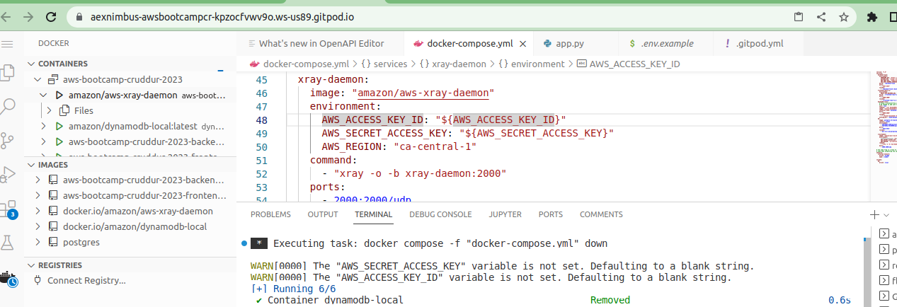


```
AWS_ACCESS_KEY_ID: "${AWS_ACCESS_KEY_ID}"
AWS_SECRET_ACCESS_KEY: "${AWS_SECRET_ACCESS_KEY}"

```

We need to add these two env vars to our backend-flask in our `docker-compose.yml` file
```
AWS_XRAY_URL: "*4567-${GITPOD_WORKSPACE_ID}.${GITPOD_WORKSPACE_CLUSTER_HOST}*"
AWS_XRAY_DAEMON_ADDRESS: "xray-daemon:2000"
```

check service data for last 10 minutes


```
EPOCH=$(date +%s)
aws xray get-service-graph --start-time $(($EPOCH-600)) --end-time $EPOCH
```

When everything is good you will see this 

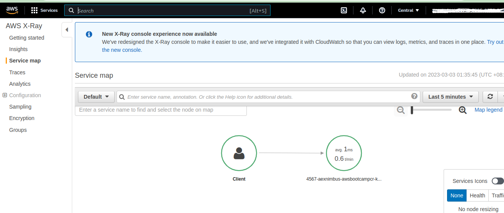

also in the cloud watch dashboard 

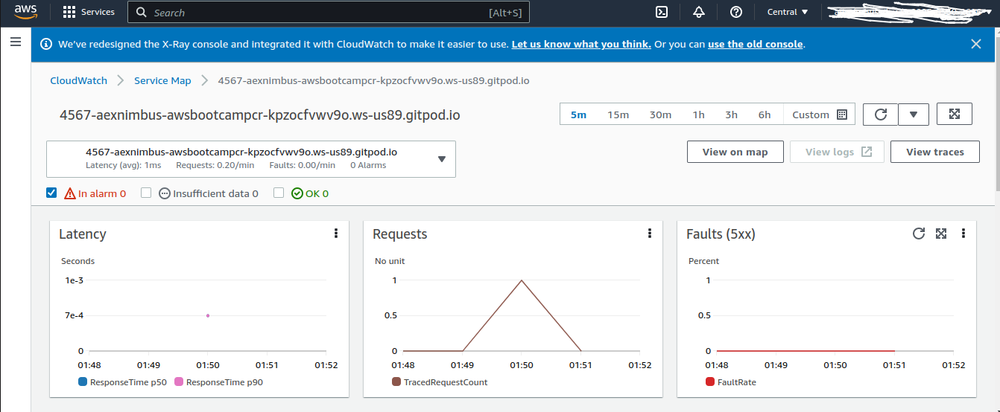
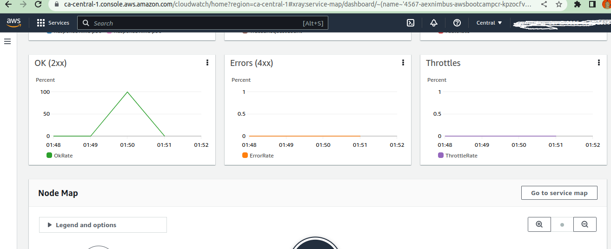
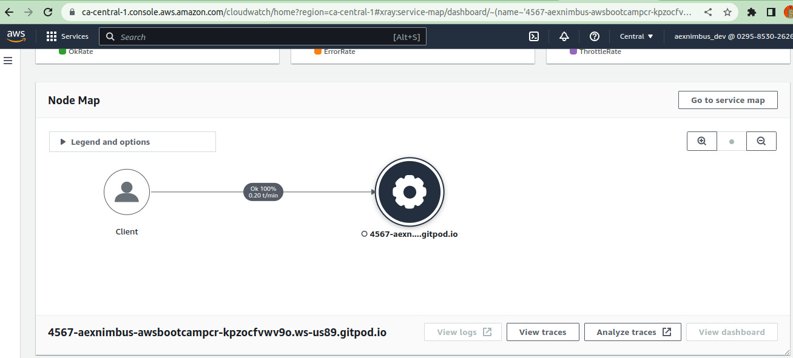

and in the xray old console dashboard 

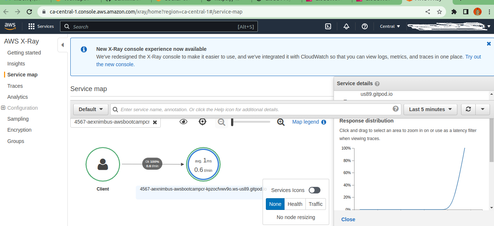

a great place to troubleshoot and debug if you having issue is the docker-compose container 

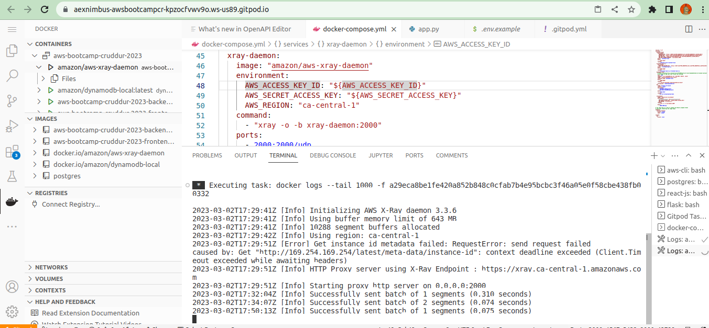


HoneyComb.io

When creating a new dataset in Honeycomb it will provide all these installation instructions

We'll add the following files to our `requirements.txt`

```
opentelemetry-api 
opentelemetry-sdk 
opentelemetry-exporter-otlp-proto-http 
opentelemetry-instrumentation-flask 
opentelemetry-instrumentation-requests
```

We'll install these dependencies:
```
pip install -r requirements.txt # run this in your current terminal
```


Add to the `app.py`
```
from opentelemetry import trace
from opentelemetry.instrumentation.flask import FlaskInstrumentor
from opentelemetry.instrumentation.requests import RequestsInstrumentor
from opentelemetry.exporter.otlp.proto.http.trace_exporter import OTLPSpanExporter
from opentelemetry.sdk.trace import TracerProvider
from opentelemetry.sdk.trace.export import BatchSpanProcessor

```

also the initialize the functions
```
#Initialize tracing and an exporter that can send data to Honeycomb
provider = TracerProvider()
processor = BatchSpanProcessor(OTLPSpanExporter())
provider.add_span_processor(processor)
trace.set_tracer_provider(provider)
tracer = trace.get_tracer(__name__)
```


```
# Initialize automatic instrumentation with Flask
app = Flask(__name__) # take this out if you have it in your app.py
FlaskInstrumentor().instrument_app(app)
RequestsInstrumentor().instrument()

```

Add the following environment variables to `backend-flask` in docker compose

```
OTEL_EXPORTER_OTLP_ENDPOINT: "https://api.honeycomb.io"
OTEL_EXPORTER_OTLP_HEADERS: "x-honeycomb-team=${HONEYCOMB_API_KEY}" # you will see this in your honeycomb ui
OTEL_SERVICE_NAME: "${HONEYCOMB_SERVICE_NAME}" # you can set up any name here 

```

You'll need to grab the API key from your honeycomb account:
```
export HONEYCOMB_API_KEY=""
export HONEYCOMB_SERVICE_NAME="Cruddur" # sample only 
gp env HONEYCOMB_API_KEY=""
gp env HONEYCOMB_SERVICE_NAME="Cruddur"

```

here is the screen shot 

when everything is working no error has been reported at the backend

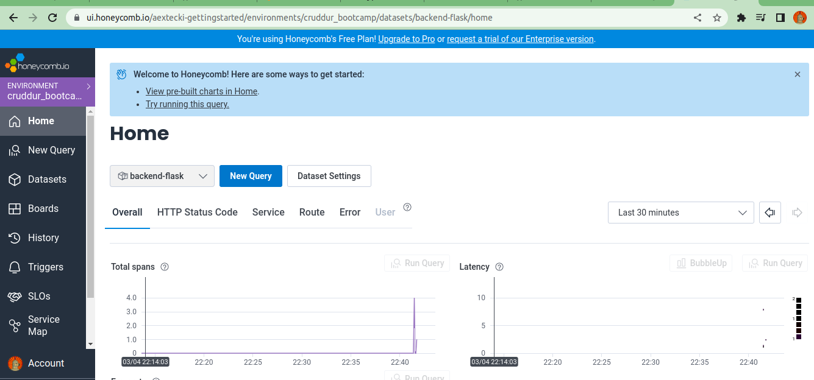

The orange color indicating cannot reach the resource cause I type it wrong.
and browser throw data type error in python.


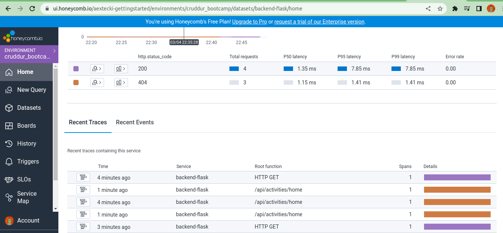

To check it at the backend I point it out to the rignt resource API end point

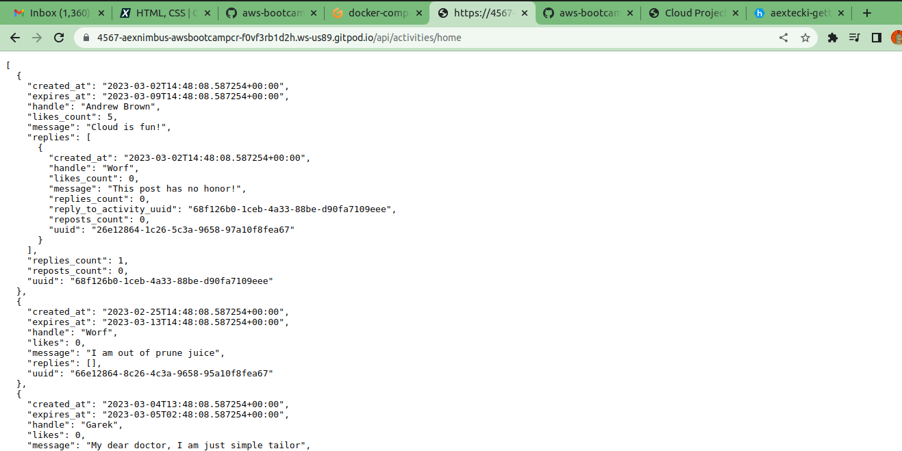

checking the query for inside honeycomb new query tab 


My docker-compose status inside gitpod


Honeycomb reported for traces honeycomb  

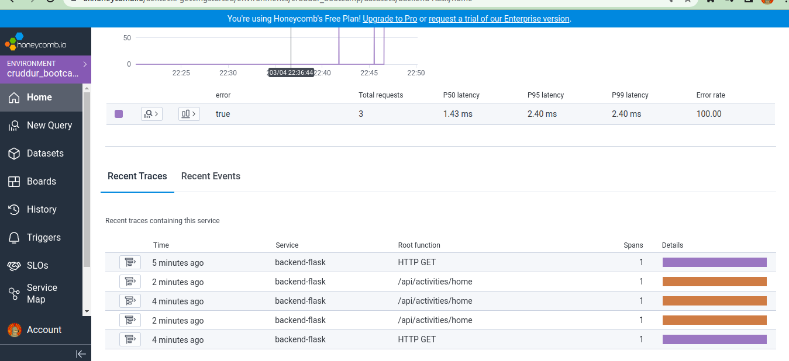

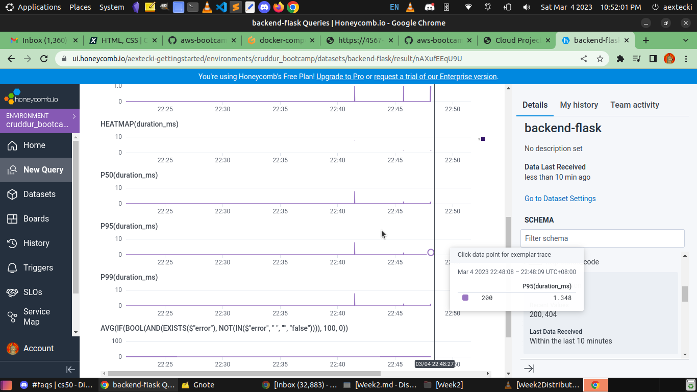


