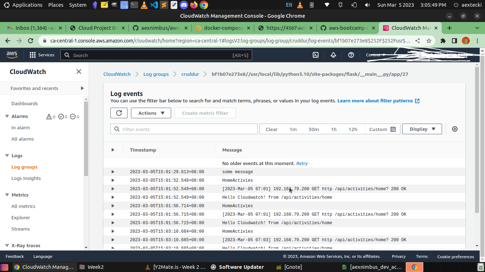
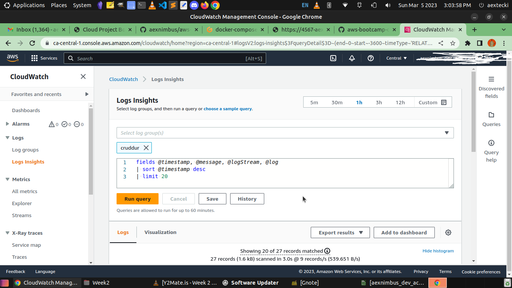

# Week 2 — Distributed Tracing

Playing with Xray inside the back-end 

```
export AWS_REGION="ca-central-1"
gp env AWS_REGION="ca-central-1"
```

Add to the  inside back end flask `requirements.txt`

```
aws-xray-sdk
```

Add python dependencies using pip install 
```
pip install aws-xray-sdk
```

Then run this at the back end-flask folder

```
pip install -r requirements.txt
```

Add to `app.py`

```
from aws_xray_sdk.core import xray_recorder
from aws_xray_sdk.ext.flask.middleware import XRayMiddleware

xray_url = os.getenv("AWS_XRAY_URL")
xray_recorder.configure(service='Cruddur', dynamic_naming=xray_url)
XRayMiddleware(app, xray_recorder)
```

Setup AWS X-ray resources 

Add `aws/json/xray.json`

```
{
  "SamplingRule": {
      "RuleName": "Cruddur",
      "ResourceARN": "*",
      "Priority": 9000,
      "FixedRate": 0.1,
      "ReservoirSize": 5,
      "ServiceName": "Cruddur",
      "ServiceType": "*",
      "Host": "*",
      "HTTPMethod": "*",
      "URLPath": "*",
      "Version": 1
  }
}
```

```
FLASK_ADDRESS="https://4567-${GITPOD_WORKSPACE_ID}.${GITPOD_WORKSPACE_CLUSTER_HOST}"
aws xray create-group \
   --group-name "Cruddur" \
   --filter-expression "service(\"$FLASK_ADDRESS\") {fault OR error}"
```

Type at the Terminal 

```
aws xray create-sampling-rule --cli-input-json file://aws/json/xray.json
```
and you will get this inside your AWS console 


[Install X-ray Daemon](https://docs.aws.amazon.com/xray/latest/devguide/xray-daemon.html)

[Github aws-xray-daemon](https://github.com/aws/aws-xray-daemon) 

[X-Ray Docker Compose example](https://github.com/marjamis/xray/blob/master/docker-compose.yml)

```
 wget https://s3.us-east-2.amazonaws.com/aws-xray-assets.us-east-2/xray-daemon/aws-xray-daemon-3.x.deb
 sudo dpkg -i **.deb
```

add daemon service to Docker-compose

```
  xray-daemon:
    image: "amazon/aws-xray-daemon"
    environment:
      AWS_ACCESS_KEY_ID: "${AWS_ACCESS_KEY_ID}"
      AWS_SECRET_ACCESS_KEY: "${AWS_SECRET_ACCESS_KEY}"
      AWS_REGION: "ca-central-1"
    command:
      - "xray -o -b xray-daemon:2000"
    ports:
      - 2000:2000/udp
```
Note: When you run the docker-compose up you will see the log for warning for this 2 env variables. you can export it manually or put it in your awscli folder. this sometimes the issue for credential error when gitpod trying to access the aws xray. 


```
AWS_ACCESS_KEY_ID: "${AWS_ACCESS_KEY_ID}"
AWS_SECRET_ACCESS_KEY: "${AWS_SECRET_ACCESS_KEY}"

```

We need to add these two env vars to our backend-flask in our `docker-compose.yml` file
```
AWS_XRAY_URL: "*4567-${GITPOD_WORKSPACE_ID}.${GITPOD_WORKSPACE_CLUSTER_HOST}*"
AWS_XRAY_DAEMON_ADDRESS: "xray-daemon:2000"
```

check service data for last 10 minutes


```
EPOCH=$(date +%s)
aws xray get-service-graph --start-time $(($EPOCH-600)) --end-time $EPOCH
```

When everything is good you will see this 


also in the cloud watch dashboard 


and in the xray old console dashboard 


a great place to troubleshoot and debug if you having issue is the docker-compose container 


HoneyComb.io

When creating a new dataset in Honeycomb it will provide all these installation instructions

We'll add the following files to our `requirements.txt`

```
opentelemetry-api 
opentelemetry-sdk 
opentelemetry-exporter-otlp-proto-http 
opentelemetry-instrumentation-flask 
opentelemetry-instrumentation-requests
```

We'll install these dependencies:
```
pip install -r requirements.txt # run this in your current terminal
```


Add to the `app.py`
```
from opentelemetry import trace
from opentelemetry.instrumentation.flask import FlaskInstrumentor
from opentelemetry.instrumentation.requests import RequestsInstrumentor
from opentelemetry.exporter.otlp.proto.http.trace_exporter import OTLPSpanExporter
from opentelemetry.sdk.trace import TracerProvider
from opentelemetry.sdk.trace.export import BatchSpanProcessor

```

also the initialize the functions
```
#Initialize tracing and an exporter that can send data to Honeycomb
provider = TracerProvider()
processor = BatchSpanProcessor(OTLPSpanExporter())
provider.add_span_processor(processor)
trace.set_tracer_provider(provider)
tracer = trace.get_tracer(__name__)
```


```
# Initialize automatic instrumentation with Flask
app = Flask(__name__) # take this out if you have it in your app.py
FlaskInstrumentor().instrument_app(app)
RequestsInstrumentor().instrument()

```

Add the following environment variables to `backend-flask` in docker compose

```
OTEL_EXPORTER_OTLP_ENDPOINT: "https://api.honeycomb.io"
OTEL_EXPORTER_OTLP_HEADERS: "x-honeycomb-team=${HONEYCOMB_API_KEY}" # you will see this in your honeycomb ui
OTEL_SERVICE_NAME: "${HONEYCOMB_SERVICE_NAME}" # you can set up any name here 

```

You'll need to grab the API key from your honeycomb account:
```
export HONEYCOMB_API_KEY=""
export HONEYCOMB_SERVICE_NAME="Cruddur" # sample only 
gp env HONEYCOMB_API_KEY=""
gp env HONEYCOMB_SERVICE_NAME="Cruddur"

```

here is the screen shot 

when everything is working no error has been reported at the backend


The orange color indicating cannot reach the resource cause I type it wrong.
and browser throw data type error in python.


To check it at the backend I point it out to the rignt resource API end point


checking the query for inside honeycomb new query tab 


My docker-compose status inside gitpod


Honeycomb reported for traces honeycomb  


CloudWatch Logs

Add to the `requirements.txt`

```
watchtower
```

```
pip install -r requirements.txt
```

In `app.py`

```
import watchtower
import logging
from time import strftime
```

```
# Configuring Logger to Use CloudWatch
LOGGER = logging.getLogger(__name__)
LOGGER.setLevel(logging.DEBUG)
console_handler = logging.StreamHandler()
cw_handler = watchtower.CloudWatchLogHandler(log_group='cruddur')
LOGGER.addHandler(console_handler)
LOGGER.addHandler(cw_handler)
LOGGER.info("some message")

@app.after_request
def after_request(response):
    timestamp = strftime('[%Y-%b-%d %H:%M]')
    LOGGER.error('%s %s %s %s %s %s', timestamp, request.remote_addr, request.method, request.scheme, request.full_path, response.status)
    return response

```

We'll log something in an API endpoint
```
LOGGER.info('Hello Cloudwatch! from  /api/activities/home')

```

Set the env var in your backend-flask for `docker-compose.yml`
```
	  AWS_DEFAULT_REGION: "${AWS_DEFAULT_REGION}"
    AWS_ACCESS_KEY_ID: "${AWS_ACCESS_KEY_ID}"
    AWS_SECRET_ACCESS_KEY: "${AWS_SECRET_ACCESS_KEY}"

```
      
> passing AWS_REGION doesn't seems to get picked up by boto3 so pass default region instead

after running the instructions above here is the results


Already run docker-compose and export my AWS credentials using bash 


Having this error LOGGER not defined 


To fix the error watch andrew brown 

https://www.youtube.com/watch?v=ipdFizZjOF4&list=PLBfufR7vyJJ7k25byhRXJldB5AiwgNnWv&index=33


you will see the cloudwatch log groups that your service name appeared in the dashboard


then you can go at log events 




at the log insight tab




Let's the ball Rolling with Rollbar

Rollbar website to create account

[https://rollbar.com/](https://rollbar.com/)

Create a new project in Rollbar called `Cruddur` or you can use the default project name just to make it organized name it specific

Add to `requirements.txt`

```
blinker
rollbar
```

Install dependencies
```
pip install -r requirements.txt
```
We need to set our access token
```
export ROLLBAR_ACCESS_TOKEN=""
gp env ROLLBAR_ACCESS_TOKEN=""
```
Add to backend-flask for `docker-compose.yml`
```
ROLLBAR_ACCESS_TOKEN: "${ROLLBAR_ACCESS_TOKEN}"
```
Import for Rollbar
```
import rollbar
import rollbar.contrib.flask
from flask import got_request_exception

rollbar_access_token = os.getenv('ROLLBAR_ACCESS_TOKEN')
@app.before_first_request
def init_rollbar():
    """init rollbar module"""
    rollbar.init(
        # access token
        rollbar_access_token,
        # environment name
        'production',
        # server root directory, makes tracebacks prettier
        root=os.path.dirname(os.path.realpath(__file__)),
        # flask already sets up logging
        allow_logging_basic_config=False)

    # send exceptions from `app` to rollbar, using flask's signal system.
    got_request_exception.connect(rollbar.contrib.flask.report_exception, app)
```
We'll add an endpoint just for testing rollbar to `app.py`
```
@app.route('/rollbar/test')
def rollbar_test():
    rollbar.report_message('Hello World!', 'warning')
    return "Hello World!"
```

[Rollbar Flask Example](https://github.com/rollbar/rollbar-flask-example/blob/master/hello.py)

result screenshot is based on my own understanding that any error or no error rollbar will give you some trace.

we start on the requirements.txt 


just a note: rollbar token is the most important piece of this code without it rollbar can't access your backend or frontend code. 
here I just deployed it on my bash environment.


Its already declared inside docker-compose.yml file so the docker will search for it. 


I got this error when running my backend code from docker-compose 


I fixed this by pasting the access code or token of rollbar to the app.py code.

Then opened the dashboard 


browsing some data and learning the error code given by rollbar 


you can see it also under items


see also the new_ui of rollbar for stack_trace.


