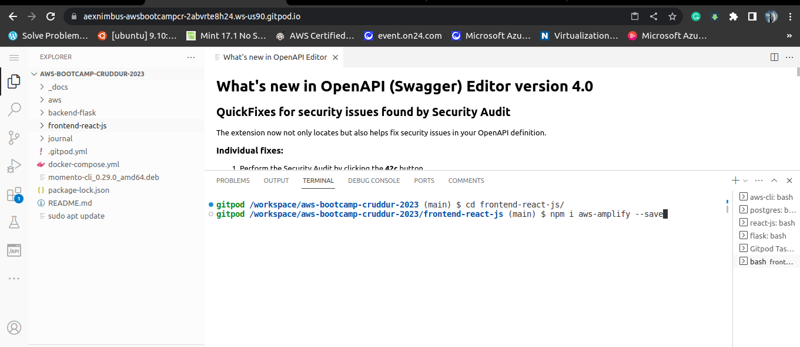
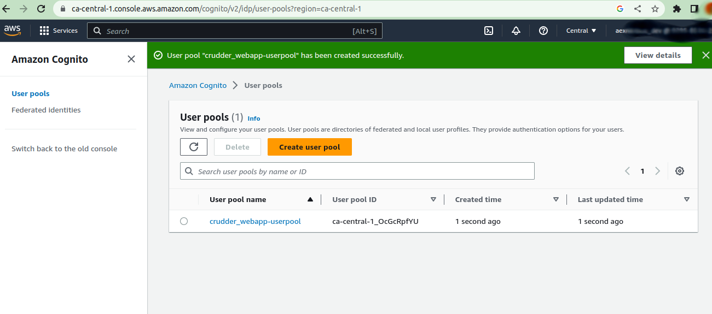

# Week 3 — Decentralized Authentication

Install Amplify inside frontend-react-js folder 

```
npm i aws-amplify --save
```



Create Cognito User Pool that reference to crudder app

It's lot of step you can follow andrew brown deck here:

https://www.youtube.com/watch?v=9obl7rVgzJw&list=PLBfufR7vyJJ7k25byhRXJldB5AiwgNnWv&index=40 

Already created a user pool from icgonito service 




